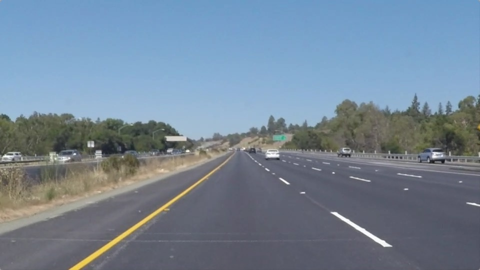
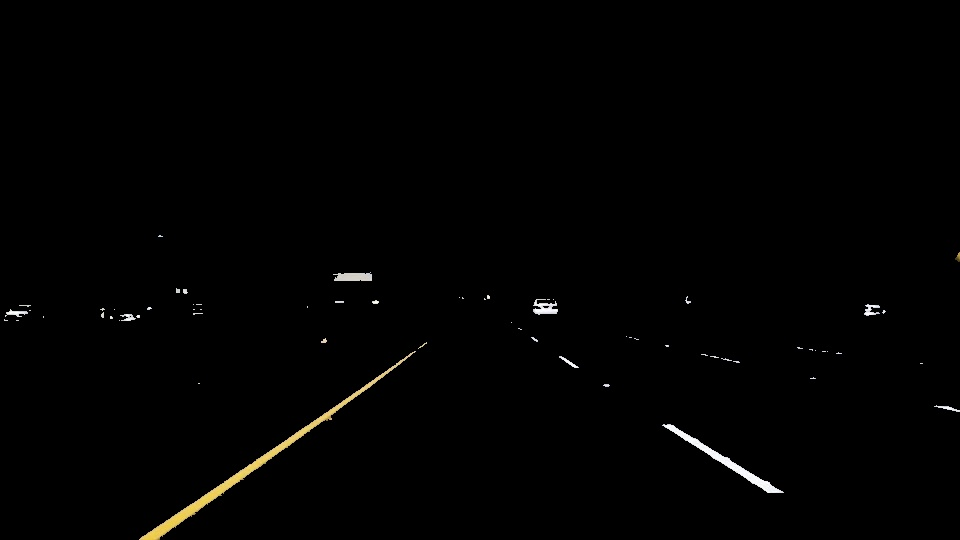
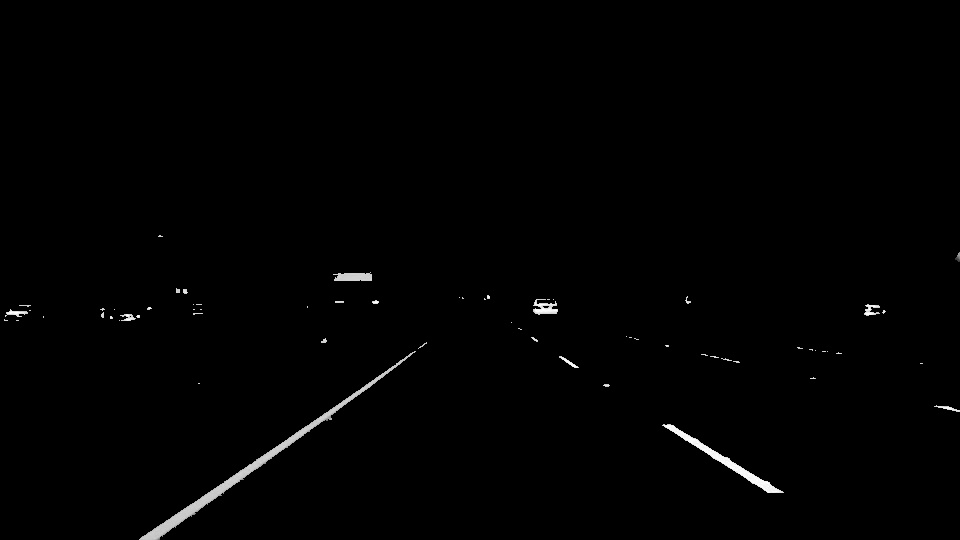
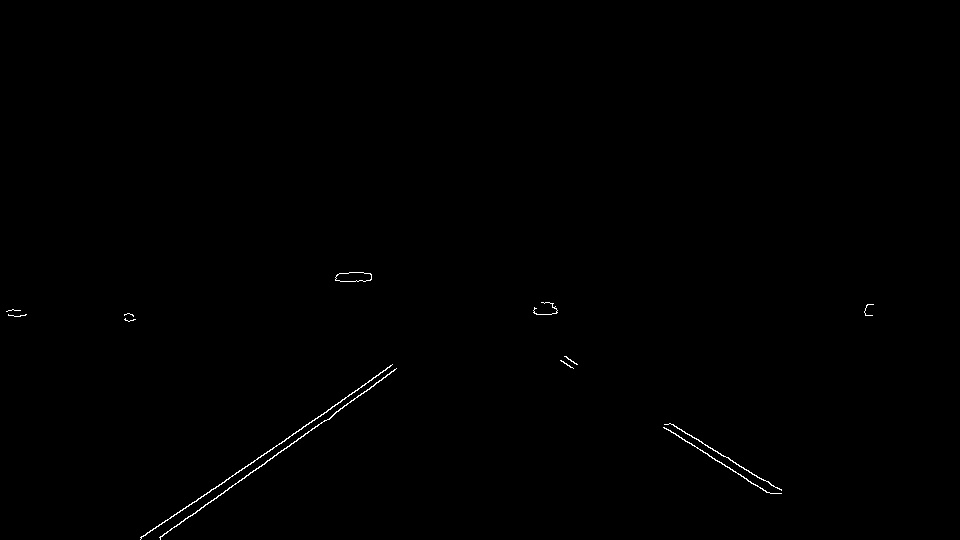
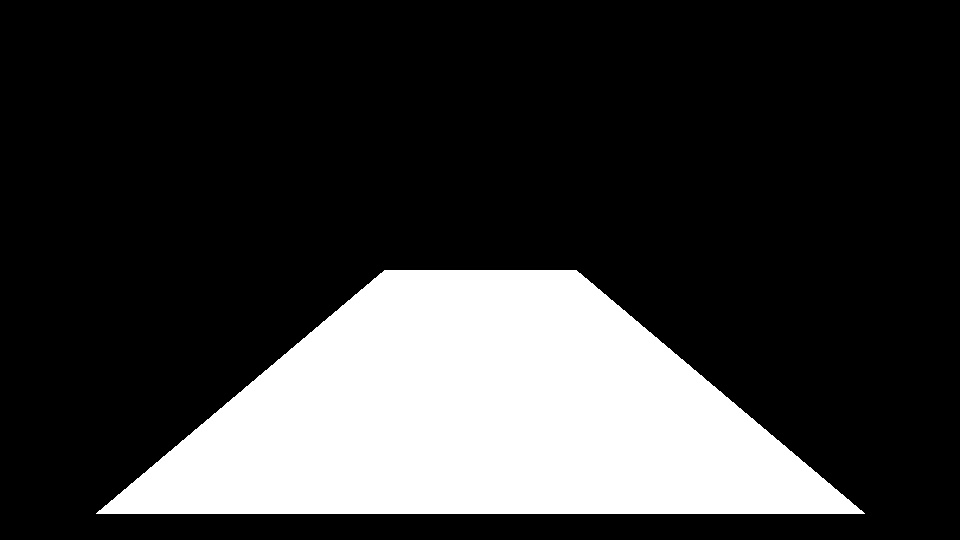
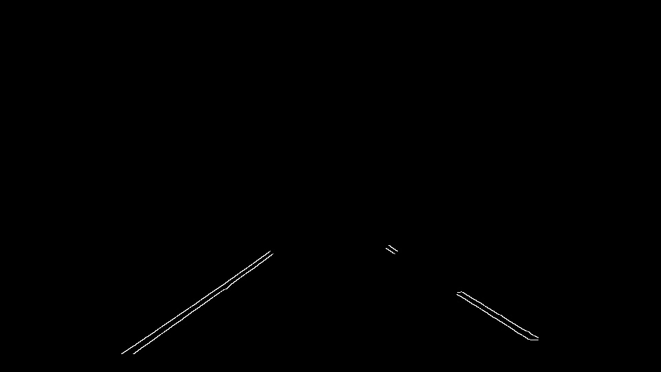
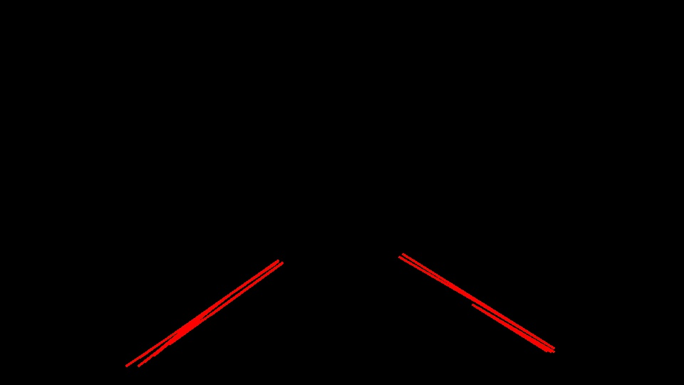
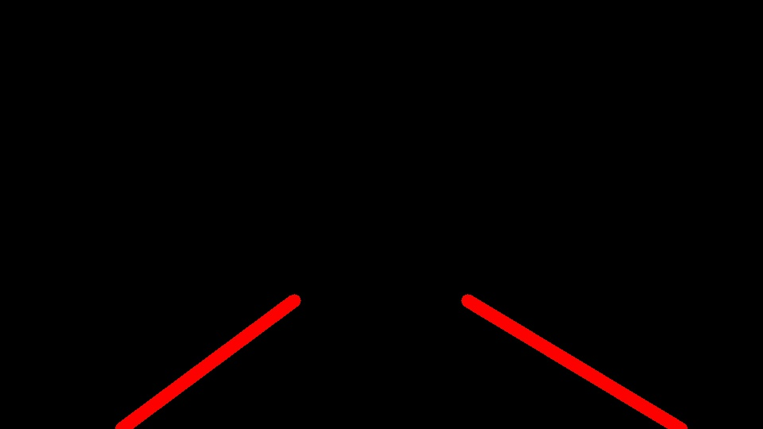
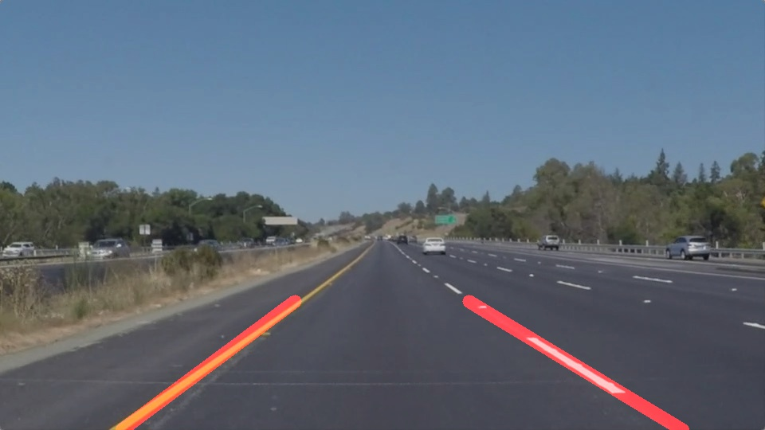

# **Finding Lane Lines on the Road** 
---

**Requirements**
* Python3.5
* Opencv-Pyhton


[image]: ./images_doc/original.jpg

[gray]: ./examples/grayscale.jpg "Grayscale"

---

#### Orignal Image


### Step-1:finding Yellow & White line on the road.
In very first step we have to convet the RGB image into HLS color space, then extract the specific color throug it.

```Python

selected=select_white_yellow(image)

```



### Step-2:Grayscale
convert the rgb(red,green,blue) image into grayscale image

**grayscale(img)**




### Step-3:Smoothing
To get good result, we have make little bit blur the grascale image.

```
smooth_image=gaussian_blur(gray_image,15)

```


### Step-4:Edge Detection(Canny)
In this step we will find the edges using Canny algorithum which is alredy provided by Opencv.In canny detction it's looks for sudden chage of color in horizonaly and vertically both.

```
low_threshold=180
high_threshold=230
edge_image=canny(smooth_image,low_threshold,high_threshold)

```



### Step-5:Region of interest
In this step we are removing the extra stuff from the image with the help of masking technique.
```
    #vertex for drawing apolygen on the black image
    ver=get_vertice(image)
    
```


```  
    #get region of interest
    roi=region_of_interest(edge_image,ver)
    
```



### Step-6:Finding Lines(Hough Line Transform)
Threre is very powerfull algorithum called **Hough Line Trasformation**, it will find the lines in the image.
we have tune some perameter to get good result.I have written in code which is given bellow.

```
 black_img,lines=hough_lines(roi,rho=2,
                         theta=np.pi/180,
                         threshold=20,
                         min_line_len=10,
                         max_line_gap=180)

```
it willl return two thing one is black image with same size of original image and another one is array of lines. here is raw view of lines. on black image.



### Step-7:Avaraging the Slop and Intercept of lines
In this we are finding the average slop and intercept of line and through this we will find out the new cordinates of lines.
```
    #getting the avrage slope and intercept
    avg_slop_left,avg_slop_right=cal_slop_inter(lines)
    
```

**finding new line cordinates**
```
    #getting the points of new lines through this avg_slope_inter perameters
    new_left_line=get_line_cord(image,avg_slop_left)
    
    new_right_line=get_line_cord(image,avg_slop_right)
    
    new_line=np.array([[new_left_line],[new_right_line]]) #with shape of (2,1,4)
    
```
### Step-8:Drawing Lines on the Image
In this final step we are drawing the lineson black image and then we will blend this black image with the original image.
```
    draw_lines(black_img,new_line,thickness=10)
    
```

**blending Image**

in this we are merging two image.

```
    final=weighted_img(black_img,image)

```



### Output Vedio

click the image to play the vedio.

[](https://www.youtube.com/watch?v=SKAgQzE4j0w)


### Shortcomings
sometimes line flicker but we can rectify that by putting some constraints.
